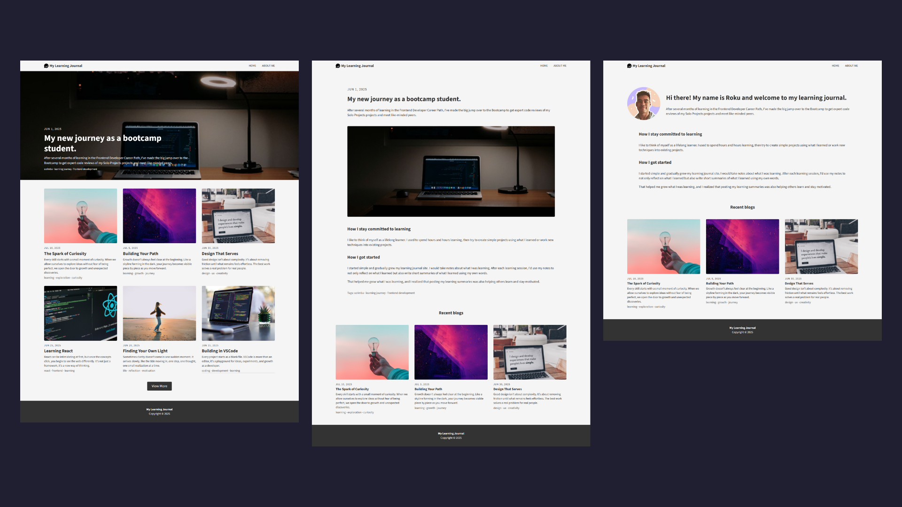
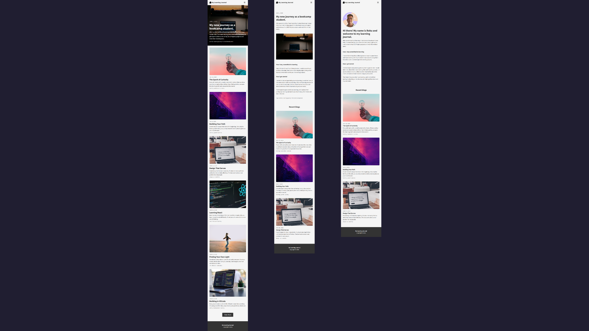

# 📝 Learning Journal Blog

A responsive learning journal blog website solo project from the [Scrimba Frontend Developer Career Path](https://scrimba.com/frontend-path-c0j).  
Users can view a featured blog, browse recent posts, and read full blog articles with a clean, accessible layout.

## 🛠️ Tech Stack
- HTML5
- CSS3
- JavaScript (ES6)

## 🚀 Features
- Featured blog hero with overlay text.
- Blog listing in grid layout with dynamic rendering.
- Pagination with "View More" button.
- Single HTML template for all blog pages via `slug`, and recent blogs.
- Responsive design and accessible hamburger menu.

## 🧩 Concepts Practiced
- DOM manipulation & template rendering.
- ES6 modules using `import`/`export`.
- URL query handling with `URLSearchParams` for routing to individual blog pages.
- Grid & Flexbox for responsive layouts.
- Pagination logic for rendering blog batches.
- Semantic HTML and accessibility.

## 💡 Future Improvements
- Multiple featured blogs in hero grid or carousel.
- Animated responsive navigation.
- Numbered pagination and/or infinite scroll.
- Clickable tags for filtering blogs.
- Search and sort functionality.
- Lazy loading images, dark mode toggle, animations, SEO optimization.
  
## 🖼️ Preview

## 🙌 Credits
- **Scrimba course:** [Scrimba Frontend Developer Career Path](https://scrimba.com/frontend-path-c0j)
- **Design reference:** [Figma by Scrimba](https://www.figma.com/design/hE5klIn1AEQ9XWZWmurs7y/Learning-Journal-Blog?node-id=0-1&p=f&t=Z0U3bPFqEfZRjIgZ-0)
- **Icons:** [Font Awesome](https://fontawesome.com/)
- **Image assets:** Provided by Scrimba
  
